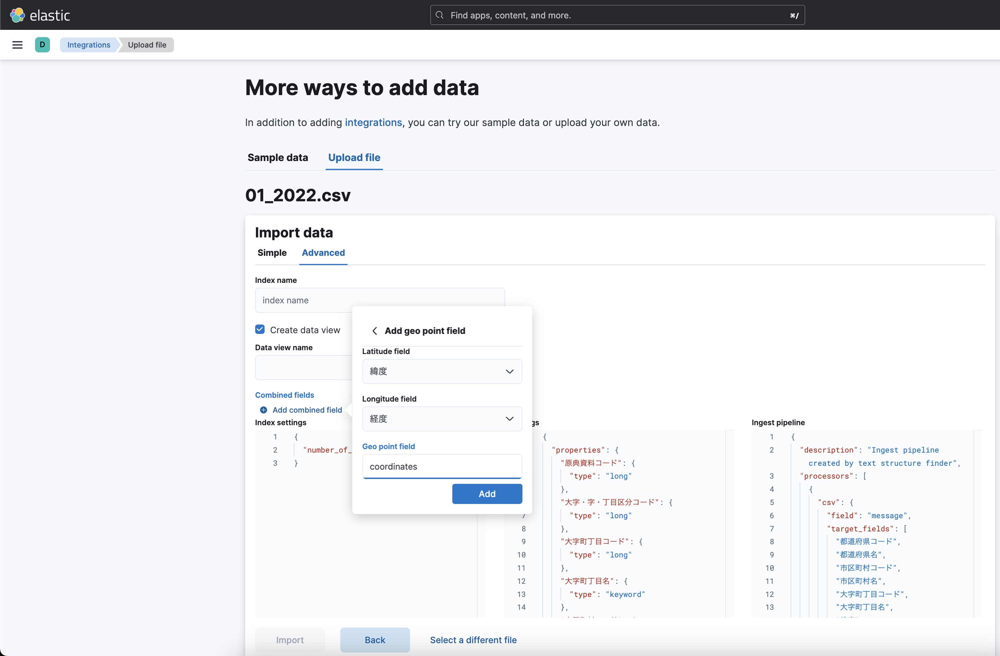

# practice_elasticsearch_fuzzyquery

## elasticsearch

- [Start a multi-node cluster with Docker Compose](https://www.elastic.co/guide/en/elasticsearch/reference/current/docker.html)

- > max virtual memory areas vm.max_map_count [65530] is too low, increase to at least [262144]
  - [How to change kernel variables so they persist 2.0 #384 (abiosoft / colima)](https://github.com/abiosoft/colima/issues/384)
- > Elasticsearch exited unexpectedly, with exit code 137
  - [elasticsearchのコンテナが137エラーで立ち上がらない (2020/08/03)](https://qiita.com/tayu1605/items/8da408c75251b30a51da)
    - 200mにして対処

- APIの叩き方
  - `$ docker cp es01:/usr/share/elasticsearch/config/certs/http_ca.crt .`
  - `$ sudo curl --cacert http_ca.crt -u elastic https://localhost:9200/_cat/indices?v`
- csvインポート時に緯度経度を `geo_point` として認識させるには、`Geo point field = coordinates` にする
  - 

## kibana

- `lcoalhost:56001`
  - user: elastic, password: password
